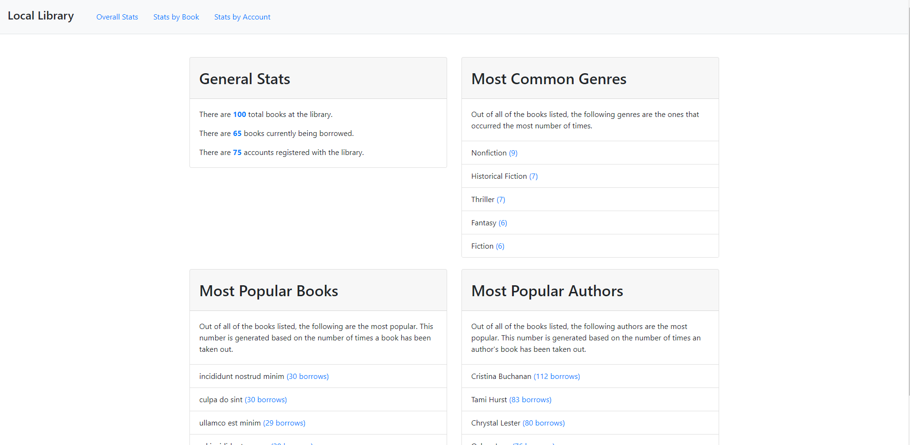
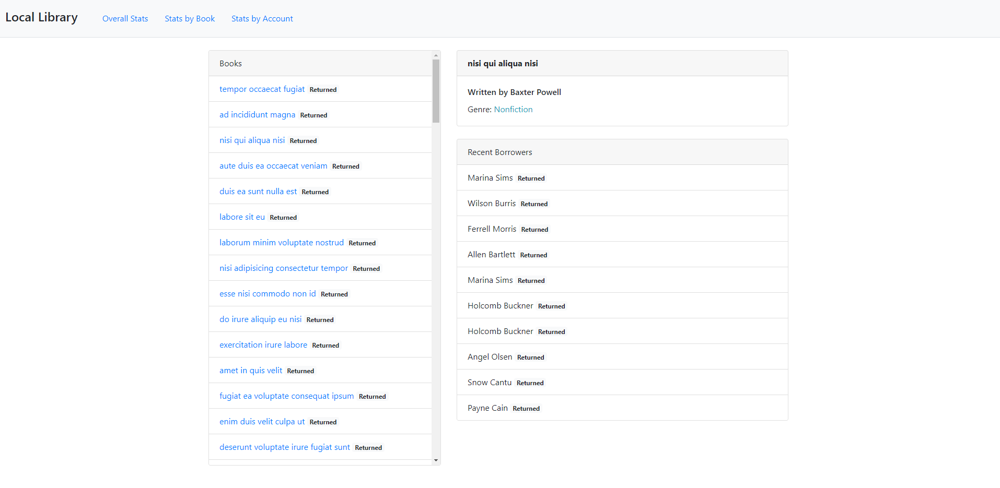
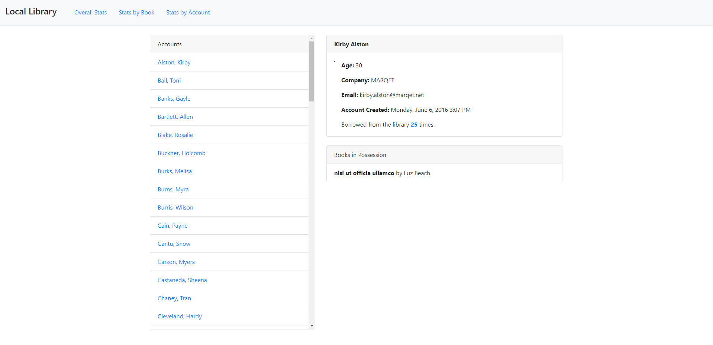

# Library-Project

The local library project is an interface to look up which books are in the library a long with their current status and borrowing history. 
It also serves to maintain borrowers account histories.

## Links

* [App Demo]()

## Installation

1. Run `npm install` to install project dependencies.
1. Run `npm run start` to start project

The deafult URL locations will be http://localhost:3000.

## Screenshots

### Home

Displays general stats of library's data

### Stats by Book 

Display each book along with their current status. When a book is selected more information about the book is displayed and a borrowing history.

### Stats by Account

Displays each account in the system along with more information on the account and which book they currently have. 

## Technology

### Built with:
* HTML, Javascript & Bootstrap
